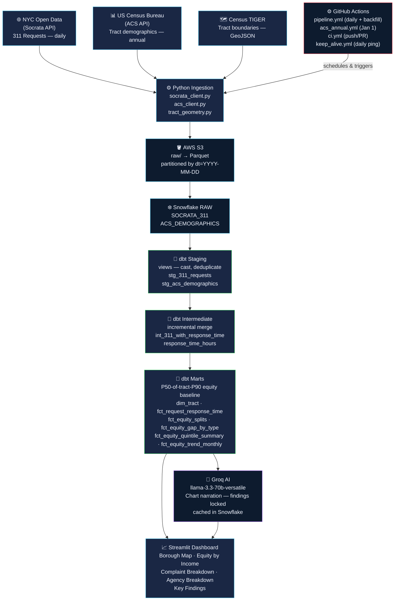

# NYC 311 Service Equity

> **If you live in Brownsville vs the Upper East Side, does the city respond to your 311 calls at the same speed?**

An end-to-end data pipeline that ingests all NYC 311 service requests, joins them to census tract demographics, and surfaces response-time equity gaps in an interactive dashboard.

**Stack**: Socrata API → GitHub Actions → S3 → Snowflake → dbt → Streamlit → Groq (AI)

---

## Table of Contents

1. [Project Structure](#1-project-structure)
2. [Prerequisites](#2-prerequisites)
3. [Clone & Install](#3-clone--install)
4. [Create Accounts & Credentials](#4-create-accounts--credentials)
5. [Configure Secrets](#5-configure-secrets)
6. [Set Up Snowflake](#6-set-up-snowflake)
7. [Test a Single-Day Ingestion](#7-test-a-single-day-ingestion)
8. [Run dbt](#8-run-dbt)
9. [Run the Historical Backfill](#9-run-the-historical-backfill)
10. [GitHub Actions (CI & Scheduled Pipeline)](#10-github-actions-ci--scheduled-pipeline)
11. [Launch the Dashboard](#11-launch-the-dashboard)
12. [AI Synthesis](#12-ai-synthesis)
13. [Troubleshooting](#13-troubleshooting)

---

## Project Workflow

End-to-end pipeline from raw city data to AI-generated equity insights.



---

## 1. Project Structure

```
nyc-311-service-equity-mart/
├── .env.example                    ← copy to .env and fill in
├── .gitignore
├── .github/
│   └── workflows/
│       ├── ci.yml                  ← lint (ruff) + dbt parse on push/PR
│       ├── pipeline.yml            ← daily 311 incremental + manual backfill
│       ├── acs_annual.yml          ← ACS demographics refresh, Jan 1 each year
│       └── keep_alive.yml          ← daily curl ping to keep Streamlit Cloud warm
├── .streamlit/
│   ├── config.toml                 ← NYC Civic Dark theme
│   └── secrets.toml                ← Snowflake + Groq + DEV_MODE (gitignored)
├── requirements.txt
├── PLAN.md
│
├── ingestion/
│   ├── config.py                   ← reads .env; typed Config dataclass
│   ├── socrata_client.py           ← Socrata API fetch + watermark logic
│   ├── acs_client.py               ← Census ACS demographics pull
│   ├── tract_geometry.py           ← geopandas point-in-polygon spatial join
│   ├── s3_writer.py                ← write Parquet to S3
│   ├── snowflake_loader.py         ← COPY INTO Snowflake RAW
│   └── backfill.py                 ← one-time historical load (2020-present)
│
├── scripts/
│   ├── run_incremental.py          ← watermark-based incremental load (used by pipeline.yml)
│   └── load_acs.py                 ← ACS fetch + S3 + Snowflake (used by acs_annual.yml)
│
├── dbt/
│   ├── dbt_project.yml
│   ├── profiles.yml.example        ← copy to ~/.dbt/profiles.yml
│   ├── packages.yml                ← dbt-utils
│   ├── models/
│   │   ├── staging/                ← views: cast, deduplicate, normalize
│   │   │   ├── _sources.yml
│   │   │   ├── _staging.yml
│   │   │   ├── stg_311_requests.sql
│   │   │   └── stg_acs_demographics.sql
│   │   ├── intermediate/           ← incremental merge; compute response_time_hours
│   │   │   ├── _intermediate.yml
│   │   │   └── int_311_with_response_time.sql
│   │   └── marts/                  ← final analytical tables
│   │       ├── _marts.yml          ← column docs + tests (dim_tract, fct_request_response_time, fct_equity_splits)
│   │       ├── _equity_marts.yml   ← column docs + tests (equity gap models)
│   │       ├── dim_tract.sql       ← census tract + income quintile
│   │       ├── fct_request_response_time.sql  ← atomic fact: one row per closed request
│   │       ├── fct_equity_splits.sql          ← P50-of-tract-P90 equity score per tract x month
│   │       ├── fct_equity_quintile_summary.sql ← median tract P90 per complaint type x quintile
│   │       ├── fct_equity_gap_by_type.sql     ← Q1 vs Q5 gap per complaint type (headline source)
│   │       └── fct_equity_trend_monthly.sql   ← response time trend by quintile over time
│   └── tests/
│       └── assert_percentile_ordering.sql
│
├── snowflake/
│   └── NYC-311-service-equity-example.sql  ← setup + verification queries
│
└── dashboard/
    ├── app.py                      ← Streamlit landing page + complaint reference table
    ├── pages/
    │   ├── 01_borough_map.py       ← choropleth map by census tract; date range filter
    │   ├── 02_equity_by_income.py  ← P50/P90 by income quintile; scatter + bar
    │   ├── 03_complaint_type_breakdown.py  ← heatmap top 20 types x borough; date filter
    │   ├── 04_agency_breakdown.py  ← equity gap grouped by responsible city agency
    │   └── 05_key_findings.py      ← gap chart, borough heatmap, trend, AI narration
    └── utils/
        ├── __init__.py
        ├── snowflake_conn.py       ← cached Snowflake connection + run_query helper
        ├── sidebar.py              ← shared sidebar with page descriptions + last refresh
        ├── auth.py                 ← DEV_MODE gate for developer-only controls
        ├── chart_helpers.py        ← reusable Plotly chart functions
        └── styles.py               ← NYC Civic Dark CSS injection
```

---

## 2. Prerequisites

| Tool | Version | Install |
|---|---|---|
| Python | 3.12 | [python.org](https://www.python.org/downloads/) |
| Git | any | [git-scm.com](https://git-scm.com/) |

You also need accounts for:
- **AWS** — S3 storage (free tier is fine for dev)
- **Snowflake** — 30-day free trial at [snowflake.com](https://signup.snowflake.com/)
- **NYC Open Data (Socrata)** — free app token at [data.cityofnewyork.us](https://data.cityofnewyork.us/login)
- **US Census API** — free key at [api.census.gov/data/key_signup.html](https://api.census.gov/data/key_signup.html)
- **Groq** — free API key at [console.groq.com](https://console.groq.com) (no credit card required)

---

## 3. Clone & Install

```bash
git clone https://github.com/your-username/nyc-311-service-equity-mart.git
cd nyc-311-service-equity-mart

python -m venv .venv
source .venv/bin/activate       # Windows: .venv\Scripts\activate

python -m pip install --upgrade pip
pip install -r requirements.txt
```

Install dbt packages (run from inside the `dbt/` directory):

```bash
cd dbt
dbt deps
cd ..
```

---

## 4. Create Accounts & Credentials

### Socrata App Token
1. Go to [data.cityofnewyork.us](https://data.cityofnewyork.us/login) → sign up / log in
2. Click your profile → **Developer Settings** → **Create New App Token**
3. Copy the **App Token** (not the secret token)

### AWS S3
1. Log into [AWS Console](https://console.aws.amazon.com/) → S3 → **Create bucket**
2. Name it `nyc-311-equity-mart` (or anything unique) — region `us-east-1`
3. IAM → Create a user → attach policy `AmazonS3FullAccess` → create **Access Key**
4. Save `AWS_ACCESS_KEY_ID` and `AWS_SECRET_ACCESS_KEY`

### Snowflake
1. Sign up for a [free trial](https://signup.snowflake.com/) — choose **AWS**, region **US East (Ohio)**
2. Note your **account identifier** (format: `abc12345.us-east-1`)
3. Your login username and password are your `SNOWFLAKE_USER` / `SNOWFLAKE_PASSWORD`

### Census API Key
1. Register at [api.census.gov/data/key_signup.html](https://api.census.gov/data/key_signup.html)
2. Key arrives by email in a few minutes

---

## 5. Configure Secrets

### Pipeline secrets (`.env`)

```bash
cp .env.example .env
```

Fill in every value:

```bash
SOCRATA_APP_TOKEN=your_token_here
SOCRATA_DATASET_ID=erm2-nwe9

AWS_ACCESS_KEY_ID=AKIA...
AWS_SECRET_ACCESS_KEY=...
AWS_DEFAULT_REGION=us-east-1
S3_BUCKET=nyc-311-equity-mart

SNOWFLAKE_ACCOUNT=abc12345.us-east-1
SNOWFLAKE_USER=your_user
SNOWFLAKE_PASSWORD=your_password
SNOWFLAKE_WAREHOUSE=COMPUTE_WH
SNOWFLAKE_DATABASE=NYC_311
SNOWFLAKE_ROLE=TRANSFORMER

CENSUS_API_KEY=your_census_key
```

### dbt profile (`~/.dbt/profiles.yml`)

This file lives outside the project and is never committed:

```yaml
nyc_311_equity:
  target: dev
  outputs:
    dev:
      type: snowflake
      account: "your_account_identifier"
      user: "your_snowflake_user"
      password: "your_snowflake_password"
      role: "TRANSFORMER"
      database: NYC_311
      warehouse: "COMPUTE_WH"
      schema: staging
      threads: 4
```

### Streamlit secrets (`.streamlit/secrets.toml`)

**Windows (PowerShell):**
```powershell
New-Item -ItemType Directory -Force ".streamlit"
Copy-Item dashboard\.streamlit\secrets.toml.example .streamlit\secrets.toml
```

**macOS / Linux:**
```bash
mkdir -p .streamlit
cp dashboard/.streamlit/secrets.toml.example .streamlit/secrets.toml
```

Edit the file:

```toml
# Top-level keys must appear BEFORE any [section] header
GROQ_API_KEY = "gsk_..."
DEV_MODE     = "false"   # set "true" to unlock developer controls in the dashboard

[snowflake]
account   = "abc12345.us-east-1"
user      = "your_user"
password  = "your_password"
warehouse = "COMPUTE_WH"
role      = "TRANSFORMER"
```

> **Never commit `.env` or `secrets.toml`** — both are in `.gitignore`.

> `DEV_MODE = "true"` enables the **Generate AI Analysis** button, force-regenerate, and clear-cache controls on the Key Findings page. Leave it `"false"` for public Streamlit Cloud deployments.

---

## 6. Set Up Snowflake

Copy and paste [`snowflake/NYC-311-service-equity-example.sql`](snowflake/NYC-311-service-equity-example.sql) (sections 1–2) into a Snowflake worksheet and run as ACCOUNTADMIN.

---

## 7. Test a Single-Day Ingestion

Before enabling the scheduled pipeline, verify the end-to-end flow. This script reads the watermark from Snowflake and fetches everything since then — the same logic the daily GitHub Actions job runs:

```bash
python scripts/run_incremental.py
```

**Expected output:**
```
Watermark: 2025-01-14T04:00:00+00:00 (48 h buffer applied)
Fetched 8,432 rows
tract_geoid coverage: 93.2%
Written to: s3://nyc-311-equity-mart/raw/socrata_311/ingestion_date=2025-01-14/part-0001.parquet
Loaded 8,432 rows into Snowflake
```

Verify in Snowflake using the queries in [`snowflake/NYC-311-service-equity-example.sql`](snowflake/NYC-311-service-equity-example.sql) (sections 3–4).

> **What the `tract_geoid` coverage percentage means:**
> Each 311 record is assigned a census tract via a point-in-polygon spatial join on its lat/lon coordinates. A record gets `NULL tract_geoid` for four reasons:
>
> | Cause | Example |
> |---|---|
> | **Phone-in complaints** | Caller reports an issue without a specific address — no coordinates recorded |
> | **Citywide complaints** | Noise policy, general agency feedback — no location attached |
> | **Coordinates outside NYC** | Data entry errors or complaints filed from outside the city limits |
> | **Water areas** | Coordinates fall in the Hudson, East River, or harbor rather than on land |
>
> Records with `NULL tract_geoid` flow through raw and staging but are dropped at `fct_request_response_time` via the `INNER JOIN dim_tract ON tract_geoid` — they never reach the equity analysis. Expect **90–95%** coverage per month. Below 85% indicates a spatial join issue.

---

## 8. Run dbt

### Verify connection (one time only)

```bash
cd dbt
dbt debug
```

Look for `Connection test: OK`. If it fails, check your `~/.dbt/profiles.yml`.

### Load ACS demographics (one time only)

dbt's mart models join 311 requests to census tract demographics. Load ACS before running dbt:

```bash
python scripts/load_acs.py
```

**Expected output:**
```
Fetching ACS 2024 5-year estimates (survey years 2020-2024) for NYC census tracts ...
  Fetched 2,168 tracts
Writing to S3 ...
  Written to: s3://nyc-311-equity-mart/raw/acs_demographics/year=2024/part-0001.parquet
Loading into Snowflake RAW.ACS_DEMOGRAPHICS (full replace) ...
Done.
```

> ACS releases each December with a ~13-month lag. After the initial load, `acs_annual.yml` refreshes this table automatically every January 1st.

### Run the models

```bash
cd dbt

dbt deps                          # install packages (if not done in step 3)

dbt run --select staging
dbt test --select staging

dbt run --select intermediate

dbt run --select marts
dbt test --select marts
```

**Check key output in Snowflake** using [`snowflake/NYC-311-service-equity-example.sql`](snowflake/NYC-311-service-equity-example.sql) (section 6).

### Data Model

**Sources → Raw**

| Table | Schema | Description |
|---|---|---|
| `SOCRATA_311` | `RAW` | Append-only 311 requests from Socrata. All VARCHAR; dedup in staging. |
| `ACS_DEMOGRAPHICS` | `RAW` | Census ACS 5-year estimates. Full replace annually. |

**dbt lineage**

```
RAW.SOCRATA_311
    └─► stg_311_requests (view)
            └─► int_311_with_response_time (incremental merge)
                    └─► fct_request_response_time (table)  <── dim_tract
                                └─► fct_equity_splits (table)
                                └─► fct_equity_quintile_summary (table)
                                            └─► fct_equity_gap_by_type (table)
                                └─► fct_equity_trend_monthly (table)

RAW.ACS_DEMOGRAPHICS
    └─► stg_acs_demographics (view)
            └─► dim_tract (table)
```

**Mart tables**

| Table | Grain | Purpose |
|---|---|---|
| `dim_tract` | Census tract | ACS demographics + income quintile assignment |
| `fct_request_response_time` | Closed 311 request | Atomic fact; `response_time_hours = closed_at - created_at` |
| `fct_equity_splits` | Complaint type × tract × month | Per-tract P50/P90; equity score = `tract_p90 / city_p90` |
| `fct_equity_quintile_summary` | Complaint type × income quintile | Median of per-tract P90s per quintile; 30-complaint floor per tract cell |
| `fct_equity_gap_by_type` | Complaint type | Q1 vs Q5 gap ratio; bilateral 500-complaint guard — **headline gap source** |
| `fct_equity_trend_monthly` | Income quintile × month | Pooled P90/P50 trend over time; response-time series, not an equity-gap series |

**Equity score methodology — P50 of tract P90s:**

> `equity_score = tract_p90 / city_p90`, where `city_p90` is the **median of all tract P90s** for that complaint type and month.
> Every tract counts equally in the baseline regardless of complaint volume.
> Score **1.0** = this tract matches the typical NYC neighborhood.
> Score **> 1.0** = residents wait longer than the citywide median tract.

**Key `fct_equity_splits` columns**

| Column | Type | Description |
|---|---|---|
| `tract_geoid` | VARCHAR | Census tract ID |
| `complaint_type` | VARCHAR | 244 distinct types from Socrata |
| `request_month` | DATE | First day of the month |
| `income_quintile` | INT | 1 = lowest income, 5 = highest |
| `p50_hours` | FLOAT | Median response time for this tract |
| `p90_hours` | FLOAT | 90th percentile response time for this tract |
| `city_p90` | FLOAT | Median tract P90 citywide — the equity baseline |
| `equity_score` | FLOAT | `tract_p90 / city_p90` — higher = worse than typical |
| `request_count` | INT | Total closed requests in this group |

**Key `fct_equity_gap_by_type` columns**

| Column | Type | Description |
|---|---|---|
| `complaint_type` | VARCHAR | One row per complaint type |
| `q1_p90_hours` | FLOAT | Median tract P90 across Q1 (lowest income) tracts |
| `q5_p90_hours` | FLOAT | Median tract P90 across Q5 (highest income) tracts |
| `q1_over_q5_gap` | FLOAT | `q1_p90 / q5_p90` — ratio > 1.0 means Q1 waits longer |
| `q1_n_complaints` | INT | Total Q1 complaints (must be >= 500 to appear) |
| `q5_n_complaints` | INT | Total Q5 complaints (must be >= 500 to appear) |

**`dim_tract`**

| Column | Type | Description |
|---|---|---|
| `tract_geoid` | VARCHAR | Census 2020 tract ID |
| `median_household_income` | INT | ACS B19013 |
| `income_quintile` | INT | NTILE(5) across all NYC tracts by income |
| `pct_below_poverty` | FLOAT | % of population below federal poverty line |

---

## 9. Run the Historical Backfill

This loads all NYC 311 data from 2020 to the present. Run it **once**, manually, before enabling the scheduled pipeline:

```bash
python -m ingestion.backfill
```

> The Socrata dataset (`erm2-nwe9`) has no records before 2020.

- Iterates month by month (Jan 2020 → present)
- ~75 months × ~200K avg rows per month
- **Expect 2–3 hours**
- Idempotent — safe to re-run if interrupted; each month overwrites the same S3 key

After it finishes, rebuild marts on the full dataset:

```bash
cd dbt
dbt run --full-refresh --select intermediate
dbt run --select marts
```

---

## 10. GitHub Actions (CI & Scheduled Pipeline)

All orchestration runs in GitHub Actions — no local server or Docker stack required.

### Workflows at a glance

| File | Trigger | What it does | Secrets needed |
|---|---|---|---|
| `ci.yml` | Push / PR to `main` (code files only) | Lint Python with `ruff`; validate dbt SQL compiles with `dbt parse` | None |
| `pipeline.yml` | Daily 6 AM UTC **or** manual dispatch | Full 311 pipeline: watermark → Socrata → S3 → Snowflake → dbt | Yes |
| `acs_annual.yml` | Jan 1 8 AM UTC **or** manual dispatch | ACS demographics refresh → S3 → Snowflake → `dim_tract` | Yes |
| `keep_alive.yml` | Daily noon UTC | `curl` ping to Streamlit Cloud to prevent cold-start sleep | None |

### `ci.yml` — Continuous Integration

Runs on every push or PR to `main` when Python or dbt files change.

- **lint**: runs `ruff` over `ingestion/`, `dashboard/`, and `scripts/`
- **dbt-parse**: writes a dummy `profiles.yml` and runs `dbt parse` — validates every model's Jinja and SQL without a live Snowflake connection

Both jobs run on `ubuntu-24.04` and are capped at 15 minutes. A `concurrency` block cancels in-progress runs for the same branch on rapid pushes.

> CI does **not** block the push — GitHub Actions runs after the commit lands. To enforce a gate, enable branch protection rules (Settings → Branches → Require status checks to pass).

### `pipeline.yml` — Scheduled Data Pipeline

**Daily schedule (`cron: 0 6 * * *`):**
1. Reads `MAX(resolution_action_updated_date)` from `RAW.SOCRATA_311` — the watermark
2. Applies a 48-hour safety buffer (catches late Socrata writes and open→closed transitions)
3. Fetches all records updated since the watermark from the Socrata API
4. Spatial-joins each record to a NYC census tract
5. Writes a dated Parquet file to S3 (`raw/socrata_311/ingestion_date=YYYY-MM-DD/`)
6. `COPY INTO` Snowflake `RAW.SOCRATA_311`
7. Runs `dbt run --select staging`, then `intermediate`, then `marts`

**Manual backfill (`workflow_dispatch` with `start_year`):**

Go to **Actions → Pipeline → Run workflow**, enter a start year (e.g. `2020`), and click Run. The job iterates month-by-month from that year to the present, writing each month to a fixed S3 key (idempotent). After ingestion, dbt rebuilds all layers.

### Required GitHub Secrets

Go to **Settings → Secrets and variables → Actions → New repository secret**:

| Secret | Where to find it |
|---|---|
| `SOCRATA_APP_TOKEN` | NYC Open Data developer settings |
| `SOCRATA_DATASET_ID` | `erm2-nwe9` |
| `AWS_ACCESS_KEY_ID` | IAM user access key |
| `AWS_SECRET_ACCESS_KEY` | IAM user access key |
| `AWS_DEFAULT_REGION` | e.g. `us-east-1` |
| `S3_BUCKET` | e.g. `nyc-311-equity-mart` |
| `SNOWFLAKE_ACCOUNT` | e.g. `abc12345.us-east-1` |
| `SNOWFLAKE_USER` | Snowflake login |
| `SNOWFLAKE_PASSWORD` | Snowflake login |
| `SNOWFLAKE_WAREHOUSE` | `COMPUTE_WH` |
| `SNOWFLAKE_DATABASE` | `NYC_311` |
| `SNOWFLAKE_ROLE` | `TRANSFORMER` |

These mirror the values in your local `.env` exactly.

### Free-tier minute budget

GitHub Free gives 2,000 minutes/month for private repos (`ubuntu` runners bill at 1×).

| Workflow | Avg runtime | Frequency | Monthly total |
|---|---|---|---|
| `ci.yml` lint | ~2 min | ~10 runs | ~20 min |
| `ci.yml` dbt-parse | ~6 min | ~10 runs | ~60 min |
| `pipeline.yml` | ~25 min | 30 runs | ~750 min |
| `acs_annual.yml` | ~15 min | 1 run (Jan 1) | ~15 min |
| `keep_alive.yml` | <1 min | 30 runs | ~15 min |
| **Total** | | | **~860 min — 43% of free quota** |

---

## 11. Launch the Dashboard

```bash
streamlit run dashboard/app.py
```

Open **http://localhost:8501** in your browser.

**Pages:**

| Page | What It Shows |
|---|---|
| **Home** (`app.py`) | Project overview, key metrics, complaint type reference table |
| **Borough Map** | Equity score choropleth by census tract. Filter by complaint type, borough, date range. |
| **Equity by Income** | P50 and P90 response time by income quintile. Bar chart + scatter. |
| **Complaint Breakdown** | P50/P90 heatmap for top 20 complaint types × borough. Date range filter. |
| **Agency Breakdown** | Equity gap by city agency. Groups complaint types by responsible agency (NYPD, HPD, DOT, etc.). |
| **Key Findings** | Within-complaint-type Q1 vs Q5 gap chart, borough × quintile heatmap, trend over time, AI chart narration. |

> Queries are cached for 1 hour. Force a refresh with `Ctrl+Shift+R` or restart the Streamlit process.

**Deploy to Streamlit Cloud:**
1. Push the repo to GitHub
2. Go to [share.streamlit.io](https://share.streamlit.io/) → New app → point to `dashboard/app.py`
3. In **Advanced settings → Secrets**, paste the contents of your `secrets.toml`

---

## 12. AI Synthesis

The **Key Findings** page includes an AI-generated plain-language description of the charts, produced by [Groq](https://console.groq.com) using `llama-3.3-70b-versatile`.

The AI acts as a **chart narrator only** — it restates verified findings in plain English and describes what each chart shows. It does not interpret, analyze, or make recommendations. The seven verified findings are locked into the system prompt and the model is explicitly prohibited from contradicting them (e.g. claiming a broad income-based gap exists at the median, which the data disproves).

### How it works

The synthesis is generated **once per unique dataset** and stored permanently in Snowflake. Groq is never called more than once per pipeline run.

```
Page load
  └─► query MARTS.AI_SYNTHESIS_CACHE (data_hash)
        ├─ complete row found → display narration, no API call
        ├─ pending row found  → "being generated" message, no API call
        └─ no row             → show button (dev mode only)

Button click (dev mode)
  └─► INSERT pending row (distributed lock -- only one session wins)
        └─► call Groq API (one request)
              └─► UPDATE row to complete with narration text
                    └─► st.rerun() -> page reads complete row -> button gone
```

`data_hash` is an MD5 of the chart data (gap table + heatmap + trend). When the pipeline loads new data the hash changes and the button reappears once.

### Setup

1. Get a free API key at [console.groq.com](https://console.groq.com) → **API Keys** → **Create API Key**

2. Add it to `.streamlit/secrets.toml` **above** the `[snowflake]` section:

```toml
GROQ_API_KEY = "gsk_..."
DEV_MODE     = "true"    # enables the Generate button

[snowflake]
account = "..."
...
```

3. The cache table (`MARTS.AI_SYNTHESIS_CACHE`) is created automatically on first page load. You can also create it manually using the DDL in [`snowflake/NYC-311-service-equity-example.sql`](snowflake/NYC-311-service-equity-example.sql) (section 7).

4. Navigate to **Key Findings** and click **Generate AI Analysis**. The button disappears after the first successful generation. Set `DEV_MODE = "false"` before deploying publicly.

### Quota

Groq free tier: **30 requests per minute**. At most one request per pipeline run — the free tier is never exhausted under normal operation.

---

## 13. Troubleshooting

**`COPY INTO` returns 0 rows**
- Check the external stage: `SHOW STAGES IN SCHEMA NYC_311.RAW;`
- Verify the S3 path: `LIST @NYC_311.RAW.S3_STAGE/raw/socrata_311/;`
- Confirm AWS credentials in `.env`

**`tract_geoid` is NULL for most rows**
- GeoJSON cache may be corrupted. Delete and re-download: `rm ingestion/data/nyc_tracts.geojson`
- Verify lat/lon values are in NYC bounds (lat 40.4–41.0, lon -74.3–-73.7)

**dbt test fails on `unique_key` in staging**
- The `QUALIFY` window in `stg_311_requests` deduplicates by `updated_at DESC`. If `updated_at` is NULL for many rows, dedup won't work. Check: `SELECT COUNT(*) FROM RAW.SOCRATA_311 WHERE resolution_action_updated_date IS NULL;`

**Equity score is exactly 1.0 for all rows**
- The `city_p90` subquery in `fct_equity_splits` is returning the same value as the tract P90. Check whether `fct_request_response_time` has data across multiple tracts: `SELECT COUNT(DISTINCT tract_geoid) FROM MARTS.FCT_REQUEST_RESPONSE_TIME;`

**`fct_equity_gap_by_type` is empty**
- Both quintiles need >= 500 complaints per complaint type to appear. Check that the full backfill has run: `SELECT COUNT(*) FROM MARTS.FCT_EQUITY_QUINTILE_SUMMARY;`

**Streamlit shows empty charts**
- Check mart row counts: `SELECT COUNT(*) FROM NYC_311.MARTS.FCT_EQUITY_SPLITS;`
- If 0, run the single-day test (Step 7) before launching the dashboard.

**AI synthesis stays stuck on "pending"**
- A process may have crashed mid-generation. In Snowflake, run: `DELETE FROM MARTS.AI_SYNTHESIS_CACHE WHERE status = 'pending';` then reload the page.

**`dbt run` fails with schema not found**
- Make sure the schemas `STAGING`, `INTERMEDIATE`, and `MARTS` exist in Snowflake (created in Step 6 via the setup SQL).
